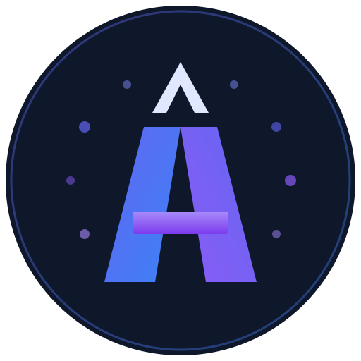

<p align="center">
  
</p>

<h1 align="center">Assemble</h1>

<p align="center">
  <strong>Your 31-agent AI team</strong><br>
  <em>An open-source project by <a href="https://cohesium.ai">Cohesium AI</a></em>
</p>

<p align="center">
  <a href="#quick-start"></a>
  
  
  
</p>

---

> Transform any IDE or CLI into a full interdisciplinary team of **31 specialized AI agents**, organized in **9 teams**, with **15 automated workflows**, **28 skills**, and **10 commands** — deployable across **20 platforms** (15 IDE + 5 CLI). Powered by Jarvis smart routing and spec-driven methodology.

## What is Assemble by Cohesium AI?

Assemble by Cohesium AI is a multi-agent orchestration system that turns your development environment into a complete, cross-functional team. Each agent is a senior-level expert in its domain, inspired by the Marvel universe, and capable of collaborating with others through automatically orchestrated workflows.

The system uses an **adapter pattern**: agent definitions, skills, and workflows are maintained as platform-agnostic source files, then a generator produces the correct configuration files for each target platform — Cursor rules, Claude Code commands, GitHub Copilot agents, and 17 others.

An orchestrator named **Jarvis** serves as the single entry point. Use `/go <request>` and Jarvis assesses complexity (trivial/moderate/complex), selects the right agents, and for complex tasks applies a spec-driven methodology with gated phases (SPECIFY → PLAN → TASKS → IMPLEMENT). All 31 agents remain accessible via `@marvel-name` mentions.

---

## Quick Start

### Using NPX (recommended)

```bash
npx create-assemble
```

### Using Bash (macOS/Linux)

```bash
curl -fsSL https://raw.githubusercontent.com/CohesiumAI/assemble/main/install.sh | bash
```

### Using Python

```bash
python3 install.py
```

### Using PowerShell (Windows)

```powershell
.\install.ps1
```

### Using Batch (Windows)

```cmd
install.bat
```

The interactive installer guides you through:

1. Choosing your **target platforms** (Cursor, Claude Code, Copilot, etc.)
2. Selecting which **agents** to activate
3. Configuring **languages** (team communication and deliverables)
4. Setting the **output directory** for deliverables

---

## Update an Existing Installation

If you already have Assemble by Cohesium AI installed, you can update to the latest version while preserving your preferences:

```bash
npx create-assemble --update
```

The `--update` flag re-generates all platform configuration files from your existing `.assemble.yaml` without re-running the interactive setup. Your agent selection, language settings, and output directory are preserved.

You can also use `/go update my config` to trigger regeneration from within a session.

---

## The Team (31 Agents)

### Dev Team (6 agents)

| Agent ID | Marvel Name | Role | @mention |
|----------|-------------|------|----------|
| `architect` | Tony Stark | System Architect | `@tony-stark` |
| `dev-backend` | Bruce Banner | Backend Developer | `@bruce-banner` |
| `dev-frontend` | Spider-Man | Frontend Developer | `@spider-man` |
| `dev-fullstack` | Mr. Fantastic | Fullstack Developer | `@mr-fantastic` |
| `dev-mobile` | Ant-Man | Mobile Developer | `@ant-man` |
| `db` | Doctor Strange | Database Architect | `@doctor-strange` |

### Ops & Quality Team (4 agents)

| Agent ID | Marvel Name | Role | @mention |
|----------|-------------|------|----------|
| `devops` | Thor | DevOps / SRE | `@thor` |
| `qa` | Hawkeye | QA / Testing | `@hawkeye` |
| `security` | Punisher | Security / InfoSec | `@punisher` |
| `automation` | Quicksilver | Automation | `@quicksilver` |

### Product & Strategy Team (4 agents)

| Agent ID | Marvel Name | Role | @mention |
|----------|-------------|------|----------|
| `pm` | Professor X | Product Manager | `@professor-x` |
| `analyst` | Nick Fury | Business Analyst | `@nick-fury` |
| `scrum` | Captain America | Scrum Master | `@captain-america` |
| `legal` | She-Hulk | Legal / Compliance | `@she-hulk` |

### Marketing & Growth Team (6 agents)

| Agent ID | Marvel Name | Role | @mention |
|----------|-------------|------|----------|
| `marketing` | Star-Lord | Marketing Manager | `@star-lord` |
| `growth` | Rocket Raccoon | Growth Hacker | `@rocket-raccoon` |
| `ads` | Gamora | Paid Media | `@gamora` |
| `seo` | Black Widow | Technical SEO | `@black-widow` |
| `content-seo` | Storm | Content SEO | `@storm` |
| `geo-aio` | Jean Grey | GEO / AIO | `@jean-grey` |

### Content & Communication Team (4 agents)

| Agent ID | Marvel Name | Role | @mention |
|----------|-------------|------|----------|
| `copywriter` | Loki | Copywriter | `@loki` |
| `brand` | Black Panther | Brand Strategist | `@black-panther` |
| `storytelling` | Silver Surfer | Storytelling | `@silver-surfer` |
| `social` | Ms. Marvel | Social Media Manager | `@ms-marvel` |

### Data & AI Team (2 agents)

| Agent ID | Marvel Name | Role | @mention |
|----------|-------------|------|----------|
| `data` | Beast | Data Analyst | `@beast` |
| `ai-engineer` | Vision | AI Engineer | `@vision` |

### Design Team (1 agent)

| Agent ID | Marvel Name | Role | @mention |
|----------|-------------|------|----------|
| `ux` | Invisible Woman | UX/UI Designer | `@invisible-woman` |

### Business & Operations Team (3 agents)

| Agent ID | Marvel Name | Role | @mention |
|----------|-------------|------|----------|
| `customer-success` | Pepper Potts | Customer Success Manager | `@pepper-potts` |
| `finance` | Iron Fist | CFO / Finance Director | `@iron-fist` |
| `pr-comms` | Phil Coulson | PR / Communications Director | `@phil-coulson` |

### Meta (2 agents)

| Agent ID | Marvel Name | Role | @mention |
|----------|-------------|------|----------|
| `contrarian` | Deadpool | Devil's Advocate | `@deadpool` |
| `jarvis` | Jarvis | Orchestrator | *(automatic — responds to /go)* |

---

## Workflows (15)

Workflows are pre-configured agent chains that orchestrate a sequence of specialists to accomplish a complete objective. Each step receives inputs from previous agents and produces outputs consumed by downstream agents. Jarvis manages the chaining automatically.

| # | Workflow | Trigger | Agent Chain | Description |
|---|----------|---------|-------------|-------------|
| 1 | MVP Launch | `/mvp` | PM, Architect, UX, DB, Backend, Frontend, QA, DevOps | Full MVP from product vision to deployment |
| 2 | Feature Development | `/feature` | PM, Analyst, Architect, Backend, Frontend, QA | End-to-end feature from spec to validation |
| 3 | Bug Fix | `/bugfix` | QA, Dev, QA | Structured bug analysis, fix, and regression test |
| 4 | Code Review Pipeline | `/review` | Fullstack, QA, Security, Contrarian | Multi-perspective code review with devil's advocate |
| 5 | Security Audit | `/security` | Security, Backend, DevOps, Legal | Full security audit with remediation and compliance |
| 6 | SEO Content Pipeline | `/seo` | SEO, Content-SEO, Copywriter, GEO/AIO | SEO-optimized content from keyword research to GEO |
| 7 | Marketing Campaign | `/campaign` | Marketing, Finance, Brand, Copywriter, Ads + Social + PR, Growth | Multi-channel campaign with budget validation and PR |
| 8 | Sprint Cycle | `/sprint` | Scrum, PM, Fullstack, QA, DevOps | Complete agile sprint from planning to release |
| 9 | Tech Debt Reduction | `/refactor` | Architect, Fullstack, QA, DevOps | Debt inventory, refactoring, and rollback strategy |
| 10 | Project Onboarding | `/onboard` | PM, Analyst, Architect, Scrum | New project scoping and team setup |
| 11 | Release Cycle | `/release` | Scrum, QA, Security, Legal, DevOps, Marketing, PR, CS | Full release with legal, PR, and customer communication |
| 12 | Hotfix Release | `/hotfix` | QA, Security, Fullstack, QA, DevOps | Emergency production fix with minimal validation |
| 13 | Dependency Upgrade | `/upgrade` | Architect, Security, Fullstack, QA, DevOps | Dependency updates with CVE check and compatibility tests |
| 14 | Documentation Sprint | `/docs` | Analyst, Architect, Fullstack, Copywriter, DevOps | Documentation inventory, writing, editing, and publishing |
| 15 | Experimentation | `/experiment` | PM, Data, Fullstack, QA, Growth | A/B experiment from hypothesis to statistical decision |

---

## Skills (28)

Skills are reusable capabilities that agents can invoke via commands. They provide structured, step-by-step processes for specific tasks.

### Shared Skills (14)

Available to multiple agents across teams.

| # | Skill | Trigger | Description |
|---|-------|---------|-------------|
| 1 | Code Review | `/review` | Structured code review with quality checklist |
| 2 | Git Workflow | `/git` | Git branching, commits, PRs, and merge management |
| 3 | Documentation | `/doc` | Technical and functional documentation generation |
| 4 | Testing | `/test` | Test strategy and execution (unit, integration, e2e) |
| 5 | Security Check | `/sec-check` | OWASP vulnerability scan and hardening audit |
| 6 | Performance Audit | `/perf` | Core Web Vitals, query optimization, load analysis |
| 7 | API Design | `/api` | REST/GraphQL API design, versioning, pagination |
| 8 | Database Query | `/db` | Database query optimization and schema design |
| 9 | CI/CD | `/cicd` | CI/CD pipeline configuration and optimization |
| 10 | Monitoring | `/monitor` | Observability setup: metrics, logs, traces, alerting |
| 11 | SEO Audit | `/seo` | Technical and on-page SEO audit |
| 12 | Content Brief | `/brief` | Structured content brief with keyword research |
| 13 | Competitive Analysis | `/benchmark` | Competitive analysis and market benchmarking |
| 14 | Reporting | `/report` | Report and dashboard generation |

### Specific Skills (14)

Specialized capabilities tied to a primary agent.

| # | Skill | Trigger | Primary Agent | Description |
|---|-------|---------|---------------|-------------|
| 1 | Backend API Scaffold | `/scaffold-api` | dev-backend | Full API scaffolding with routes, controllers, docs |
| 2 | Frontend Component | `/component` | dev-frontend | React/Next.js component with design system integration |
| 3 | Mobile Screen | `/screen` | dev-mobile | React Native/Flutter screen with navigation and state |
| 4 | DB Migration | `/migrate` | db | Database migration creation with rollback and validation |
| 5 | DevOps Pipeline | `/pipeline` | devops | Complete CI/CD pipeline with build, test, and deploy |
| 6 | Pentest Scan | `/pentest` | security | Automated penetration test with vulnerability report |
| 7 | Legal Compliance Check | `/compliance` | legal | GDPR, AI Act, and nLPD regulatory compliance check |
| 8 | Ad Campaign Setup | `/ad-setup` | ads | Multi-platform ad campaign configuration |
| 9 | Growth Experiment | `/experiment` | growth | Growth experiment design with hypothesis and metrics |
| 10 | UX Wireframe | `/wireframe` | ux | Wireframes and interactive prototypes |
| 11 | Sprint Planning | `/sprint-plan` | scrum | Agile sprint planning with estimation and prioritization |
| 12 | QA Test Plan | `/test-plan` | qa | Complete test plan with coverage matrices and criteria |
| 13 | Automation Workflow | `/automate` | automation | Multi-tool automation workflow with triggers and monitoring |
| 14 | Party Mode | `/party` | all | Persistent collaborative multi-agent session |

---

## Supported Platforms (20)

### IDE Platforms (15)

| Platform | Configuration Files |
|----------|--------------------|
| Cursor | `.cursorrules`, `.cursor/agents/`, `.cursor/skills/`, `.cursor/workflows/` |
| Windsurf | `.windsurfrules`, `.windsurf/rules/`, `.windsurf/workflows/` |
| Cline | `.clinerules`, `.cline/agents/`, `.cline/skills/`, `.cline/workflows/` |
| Roo Code | `.roomodes`, `.roo/rules-*` |
| GitHub Copilot | `.github/copilot-instructions.md`, `.github/instructions/` |
| Kiro | `.kiro/agents/*.json`, `.kiro/steering/` |
| Trae | `.trae/rules/`, `.trae/agents/`, `.trae/skills/`, `.trae/workflows/` |
| Google Antigravity | `.antigravity/agents/`, `.antigravity/skills/`, `.antigravity/workflows/` |
| CodeBuddy | `.codebuddy/agents/`, `.codebuddy/skills/`, `.codebuddy/workflows/` |
| Crush | `.crush/agents/`, `.crush/skills/`, `.crush/workflows/` |
| iFlow | `.iflow/agents/`, `.iflow/skills/`, `.iflow/flows/` |
| KiloCoder | `.kilocoder/agents/`, `.kilocoder/skills/`, `.kilocoder/workflows/` |
| OpenCode | `.opencode/agents/`, `.opencode/skills/`, `.opencode/workflows/` |
| QwenCoder | `.qwencoder/agents/`, `.qwencoder/skills/`, `.qwencoder/workflows/` |
| Rovo Dev | `.rovo/agents/`, `.rovo/skills/`, `.rovo/workflows/` |

### CLI Platforms (5)

| Platform | Configuration Files |
|----------|--------------------|
| Claude Code | `CLAUDE.md`, `.claude/agents/*/AGENT.md`, `.claude/skills/*/SKILL.md`, `.claude/rules/` |
| Codex (OpenAI) | `AGENTS.md` |
| Gemini CLI | `GEMINI.md`, `.gemini/agents/`, `.gemini/skills/`, `.gemini/workflows/` |
| Auggie | `.augment/commands/*.md` |
| Pi | `AGENTS.md`, `SYSTEM.md` |

---

## Architecture

```
assemble/
  src/
    agents/             # 31 agent definition files (AGENT-*.md)
    skills/
      shared/           # 14 shared skills (multi-agent)
      specific/         # 13 agent-specific skills
    workflows/          # 15 workflow definitions (YAML)
    orchestrator/       # ORCHESTRATOR.md (Jarvis)
    config/
      defaults.yaml     # Default configuration
      teams.yaml        # Team definitions (9 teams)
    commands/
      commands.yaml     # Registry of 10 primary commands + hidden shortcuts + internal skills
  generator/            # Platform-specific file generator
  bin/                  # CLI entry point (npx create-assemble)
  install.sh            # Bash installer
  install.py            # Python installer
  install.ps1           # PowerShell installer (Windows)
  install.bat           # Batch installer (Windows)
```

### Execution Flow

```
User types /go <request>
      |
      v
  Jarvis (Orchestrator)
      |
      +-- Assess complexity (TRIVIAL / MODERATE / COMPLEX)
      +-- Match a workflow or select agents
      |
      +── TRIVIAL → single agent, direct answer
      +── MODERATE → 2-3 agents, sequential execution
      +── COMPLEX → Spec-Driven Methodology:
      |     1. SPECIFY (@professor-x) → spec.md → user validates
      |     2. PLAN (@tony-stark) → plan.md → user validates
      |     3. TASKS (@captain-america) → tasks.md → user validates
      |     4. IMPLEMENT (Dev agents) → code + tests
      |     5. CLOSE (Jarvis) → _quality.md (auto)
      |
      v
  Sequential Execution
      |
      +-- Agent 1 --> deliverables --> _manifest.yaml updated
      +-- Agent N --> deliverables --> _manifest.yaml updated
      |
      v
  Consolidation → _summary.md + _quality.md → Report to user
```

---

## Configuration

After installation, a `.assemble.yaml` file is created at the root of your project:

```yaml
# Assemble — Configuration du projet
version: "1.0.0"
langue_equipe: "english"          # Language for agent-to-agent communication
langue_output: "english"          # Language for produced deliverables
output_dir: "./assemble-output"   # Output directory for deliverables
platforms: [claude-code, cursor]  # Target platforms
agents: all                       # Activated agents (all or list)
workflows: all                    # Activated workflows (all or list)
governance: "none"                # none | standard (see Governance section)
installed_at: "2026-03-19"
```

---

## Governance (optional)

Assemble includes an opt-in governance layer that adds **decision gates** and **change risk assessment** to workflows. Works across all 20 supported platforms. **Disabled by default** — zero overhead when not needed.

> **Note:** `_quality.md` (deliverables, validations, remaining risks, lessons learned) is always produced at the end of COMPLEX workflows (4+ steps) as part of Phase 5 CLOSE — this is baseline behavior, not governance-specific. Governance adds the **gates** and **risk controls** that govern _how_ you get there.

### Enabling governance

Set `governance: "standard"` in `.assemble.yaml`:

```yaml
governance: "standard"
```

Then regenerate: `npx create-assemble --update`

### What it adds

| Layer | Description |
|-------|-------------|
| **Decision Gates** | TRIVIAL = agent acts freely. MODERATE = deliverable + user validation. COMPLEX = phased approval (spec → plan → tasks → implement). |
| **Change Risk Assessment** | LOW risk (`/bugfix`, `/review`) = post-action summary. MEDIUM (`/feature`, `/sprint`) = plan required. HIGH (`/release`, `/hotfix`, `/mvp`) = risk assessment + rollback plan + approval gate. |

### Token impact

| Mode | Permanent cost | On-demand cost |
|------|---------------|----------------|
| `governance: "none"` (default) | 0 extra tokens | 0 |
| `governance: "standard"` | ~20 tokens (routing reference) | ~200 tokens (governance.md loaded when relevant) |

### How it works across platforms

- **All 20 platforms:** Governance rules are injected into the command registry that every adapter generates. When `governance: "standard"`, the AI receives decision gates, risk assessment, and quality checkpoint instructions as part of its rules.
- **Claude Code (additionally):** A dedicated `.claude/rules/governance/governance.md` file is generated for on-demand loading by Jarvis.
- **Platforms with orchestrator** (Cursor, Copilot, Cline, Windsurf, Kiro, Roo Code, Codex, Gemini CLI, Pi): Governance behavior is also embedded in the orchestrator instructions.

---

## Documentation

| Document | Contents |
|----------|----------|
| [Agent Catalog](docs/AGENTS.md) | Complete catalog of all 31 agents with roles, skills, and workflows |
| [Skills Reference](docs/SKILLS.md) | 28 skills (14 shared + 14 specific) with detailed processes |
| [Workflow Guide](docs/WORKFLOWS.md) | 15 workflows with agent chains, inputs/outputs, and dependency graphs |
| [Platform Support](docs/PLATFORMS.md) | Platform-specific setup guides and file structure details |
| [Command Reference](docs/COMMANDS.md) | Full reference for 10 commands + hidden shortcuts |

---

## Contributing

1. Fork the repository
2. Create a feature branch (`git checkout -b feature/my-feature`)
3. Follow the existing file naming conventions (`AGENT-*.md`, `*.yaml`)
4. Test your changes by running the generator: `npm run generate`
5. Validate the output: `npm run validate`
6. Submit a pull request

Agent definitions live in `src/agents/`, skills in `src/skills/`, and workflows in `src/workflows/`. The generator in `generator/` transforms these source files into platform-specific configurations.

---

## License

MIT — An open-source project by [Cohesium AI](https://cohesium.ai)
